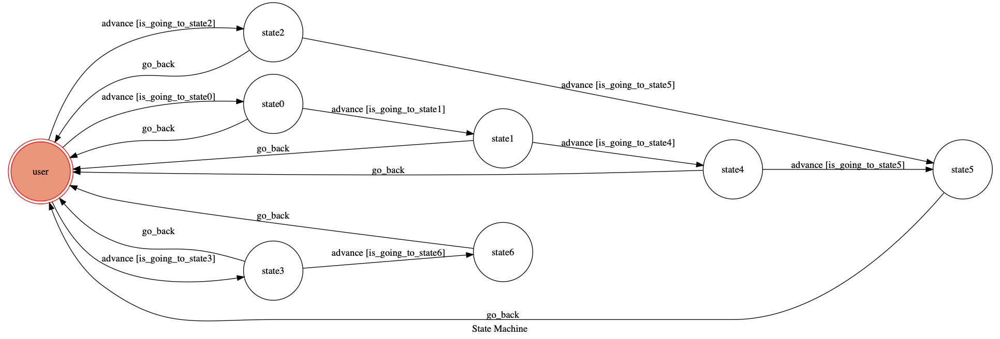

# TOC Project 2019

Template Code for TOC Project 2019

A Facebook messenger bot based on a finite state machine

More details in the [Slides](https://hackmd.io/p/SkpBR-Yam#/) and [FAQ](https://hackmd.io/s/B1Xw7E8kN)

## Setup

### Prerequisite
* Python 3
* Facebook Page and App
* HTTPS Server

#### Install Dependency
```sh
pip3 install -r requirements.txt
```

* pygraphviz (For visualizing Finite State Machine)
    * [Setup pygraphviz on Ubuntu](http://www.jianshu.com/p/a3da7ecc5303)

#### Secret Data

`VERIFY_TOKEN` and `ACCESS_TOKEN` **MUST** be set to proper values.
Otherwise, you might not be able to run your code.

#### Run Locally
You can either setup https server or using `ngrok` as a proxy.

**`ngrok` would be used in the following instruction**

```sh
./ngrok http 5000
```

After that, `ngrok` would generate a https URL.

#### Run the sever

```sh
python3 app.py
```

## Finite State Machine


## Usage
一開始讓User選擇是要team(state3)， scores(state0)還是要today scores(state1)
如果輸入team的話，會要求User輸入隊名，系統會回傳該隊的戰績
如果輸入scores的話，會要求User輸入月份(state1)跟日期(state4)，系統會回傳那天所有的對戰分數
如果輸入today scores的話，會直接回傳當天所有對戰分數
如果User想要看各節的比分就可以直接輸入編號


